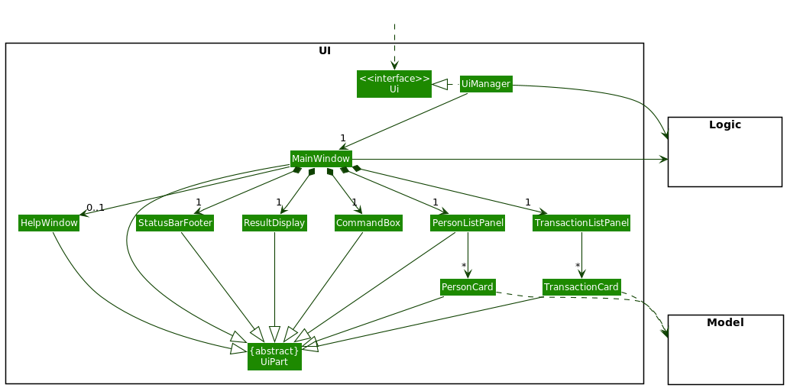
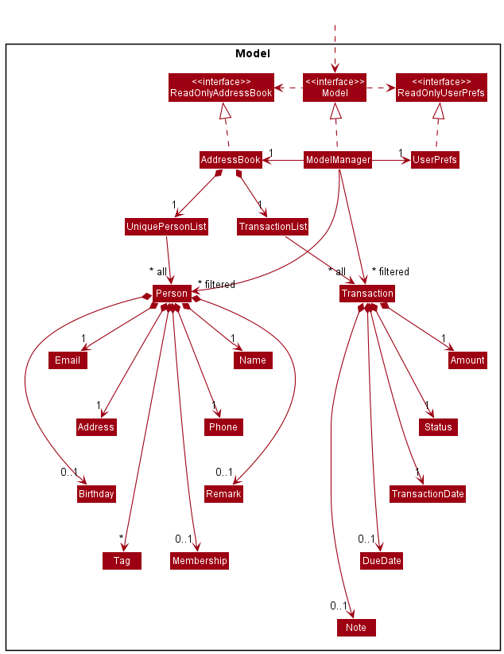
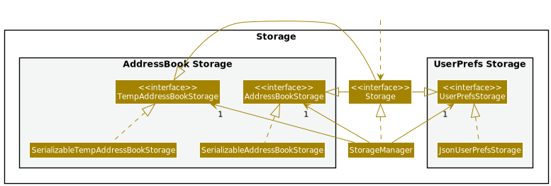
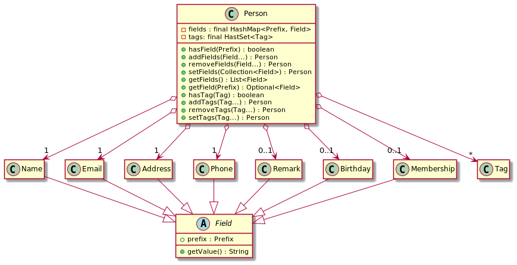
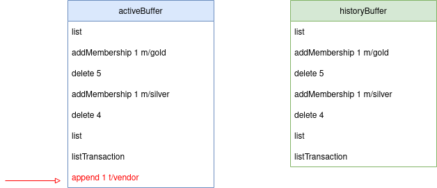
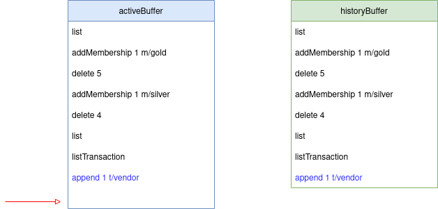
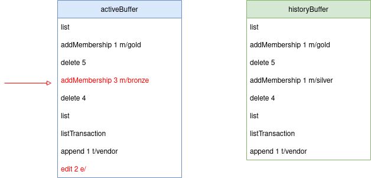
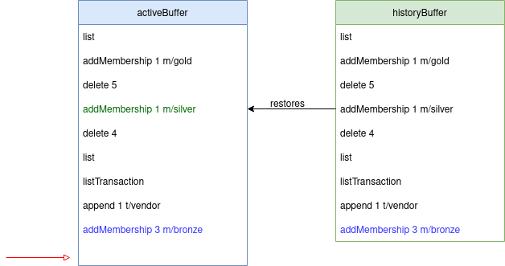
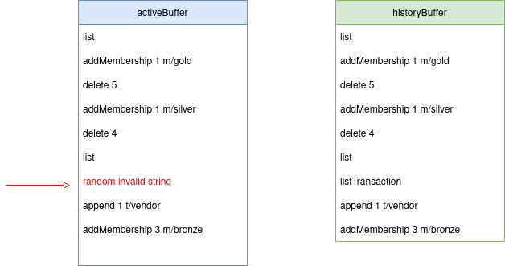
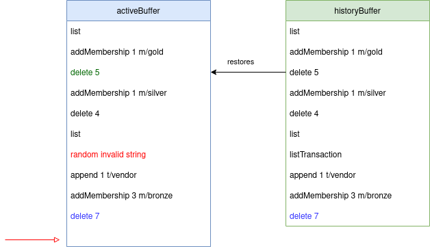

* Table of Contents
{:toc}

--------------------------------------------------------------------------------------------------------------------

## **Acknowledgements**

List of sources of all code and third-party libraries:
* This project is based on the AddressBook-Level3 projected created by the [SE-EDU](https://se-education.org/) initiative.
* Libraries used: [JavaFX](https://openjfx.io/)

--------------------------------------------------------------------------------------------------------------------

## **Setting up, getting started**

Refer to the guide [_Setting up and getting started_](SettingUp.md).

--------------------------------------------------------------------------------------------------------------------

## **Design**

:bulb: **Note** 

The `.puml` files used to create diagrams in this document can be found in the [diagrams](https://github.com/AY2122S2-CS2103T-W09-2/tp/master/main/docs/diagrams/) folder. Refer to the [_PlantUML Tutorial_ at se-edu/guides](https://se-education.org/guides/tutorials/plantUml.html) to learn how to create and edit diagrams.

### Architecture

*Figure: High-level architecture diagram of the CinnamonBun.*

Given below is a quick overview of main components and how they interact with each other.

**Main components of the architecture**

**`Main`** has two classes called [`Main`](https://github.com/AY2122S2-CS2103T-W09-2/tp/blob/master/src/main/java/seedu/address/Main.java)
and [`MainApp`](https://github.com/AY2122S2-CS2103T-W09-2/tp/blob/master/src/main/java/seedu/address/MainApp.java).
It is responsible for,
* At app launch: Initializes the components in the correct sequence, and connects them up with each other.
* At shut down: Shuts down the components and invokes cleanup methods where necessary.

[**`Commons`**](#common-classes) represents a collection of classes used by multiple other components.

The rest of the App consists of four components.
* [**`UI`**](#ui-component): The UI of the App.
* [**`Logic`**](#logic-component): The command executor.
* [**`Model`**](#model-component): Holds the data of the App in memory.
* [**`Storage`**](#storage-component): Reads data from, and writes data to, the hard disk.

**How the architecture components interact with each other**

*Figure: Sequence diagram of main components' interaction when use issues the command `delete 1`.*

Each of the four main components (also shown in the diagram above),
* defines its *API* in an `interface` with the same name as the Component.
* implements its functionality using a concrete `{Component Name}Manager` class (which follows the corresponding API `interface` mentioned in the previous point.

For example, the `Logic` component defines its API in the `Logic.java` interface and implements its functionality using the `LogicManager.java` class which follows the `Logic` interface. Other components interact with a given component through its interface rather than the concrete class (reason: to prevent outside component's being coupled to the implementation of a component), as illustrated in the (partial) class diagram below.

*Figure: Partial class diagram of interaction of the main components.*

The sections below give more details of each component.

### UI component

*Figure: Overview of CinnamonBun's GUI.*

The **API** of this component is specified in [`Ui.java`](https://github.com/AY2122S2-CS2103T-W09-2/tp/blob/master/src/main/java/seedu/address/ui/Ui.java)

*Figure: Class diagram of CinnamonBun's GUI using JavaFX framework.*

The UI consists of a `MainWindow` that is made up of parts e.g.`CommandBox`, `ResultDisplay`, `PersonListPanel`, `TransactionListPanel`, `StatusBarFooter` etc. All these, including the `MainWindow`, inherit from the abstract `UiPart` class which captures the commonalities between classes that represent parts of the visible GUI.

The `UI` component uses the JavaFx UI framework. The layout of these UI parts are defined in matching `.fxml` files that are in the `src/main/resources/view` folder. For example, the layout of the [`MainWindow`](https://github.com/se-edu/addressbook-level3/tree/master/src/main/java/seedu/address/ui/MainWindow.java) is specified in [`MainWindow.fxml`](https://github.com/se-edu/addressbook-level3/tree/master/src/main/resources/view/MainWindow.fxml)

The `UI` component,
* executes user commands using the `Logic` component.
* listens for changes to `Model` data so that the UI can be updated with the modified data.
* keeps a reference to the `Logic` component, because the `UI` relies on the `Logic` to execute commands.
* depends on some classes in the `Model` component, as it displays `Person` and `Transaction` object residing in the `Model`.

### Logic component

**API** : [`Logic.java`](https://github.com/AY2122S2-CS2103T-W09-2/tp/blob/master/src/main/java/seedu/address/logic/Logic.java)

*Figure: Partial class diagram of the `Logic` component.*

How the `Logic` component works:
1. When `Logic` is called upon to execute a command, it uses the `AddressBookParser` class to parse the user command.
1. This results in a `Command` object (more precisely, an object of one of its subclasses e.g., `AddCommand`) which is executed by the `LogicManager`.
1. The command can communicate with the `Model` when it is executed (e.g. to add a person).
1. The result of the command execution is encapsulated as a `CommandResult` object which is returned back from `Logic`.

*Figure: Interactions inside the logic component for the `delete 1` command.*

:information_source: **Info** 

The lifeline for `DeleteCommandParser` should end at the destroy marker (X) but due to a limitation of PlantUML, the lifeline reaches the end of diagram.

Here are the other classes in `Logic` (omitted from the class diagram above) that are used for parsing a user command:

How the parsing works:
* When called upon to parse a user command, the `AddressBookParser` class creates an `XYZCommandParser` (`XYZ` is a placeholder for the specific command name e.g., `AddCommandParser`) which uses the other classes shown above to parse the user command and create a `XYZCommand` object (e.g., `AddCommand`) which the `AddressBookParser` returns back as a `Command` object.
* All `XYZCommandParser` classes (e.g., `AddCommandParser`, `DeleteCommandParser`, ...) inherit from the `Parser` interface so that they can be treated similarly where possible e.g, during testing.

### Model component
**API** : [`Model.java`](https://github.com/AY2122S2-CS2103T-W09-2/tp/blob/master/src/main/java/seedu/address/model/Model.java)

*Figure: Class diagram of `Model` component.*

The `Model` component,

* stores the client data i.e., all `Person` objects (which are contained in a `UniquePersonList` object).
* stores the currently 'selected' `Person` objects (e.g., results of a search query) as a separate _filtered_ list which is exposed to outsiders as an unmodifiable `ObservableList<Person>` that can be 'observed' e.g. the UI can be bound to this list so that the UI automatically updates when the data in the list change.
* stores the transaction data i.e., all `Transaction` objects (which are contained in a `TransactionList` object).
* stores the currently 'selected' `Transaction` objects (e.g., results of a search query) as a separate _filtered_ list which is exposed to outsiders as an unmodifiable `ObservableList<Transaction>` that can be 'observed' e.g. the UI can be bound to this list so that the UI automatically updates when the data in the list change.
* stores a `UserPref` object that represents the user’s preferences. This is exposed to the outside as a `ReadOnlyUserPref` objects.
* does not depend on any of the other three components (as the `Model` represents data entities of the domain, they should make sense on their own without depending on other components).

### Storage component

**API** : [`Storage.java`](https://github.com/AY2122S2-CS2103T-W09-2/tp/blob/master/src/main/java/seedu/address/storage/Storage.java)

*Figure: Class diagram of `Storage` component.*

The `Storage` component,
* stores user preference data in json format, and reads it back into corresponding objects.
* stores client and transaction data in binary format, and reads it back into corresponding objects.
* inherits from both `AddressBookStorage` and `UserPrefStorage`, which means it can be treated as either one (if only the functionality of only one is needed).
* depends on some classes in the `Model` component (because the `Storage` component's job is to save/retrieve objects that belong to the `Model`)

### Common classes

Classes used by multiple components are in the `seedu.addressbook.commons` package.

--------------------------------------------------------------------------------------------------------------------

## **Implementation**

This section describes some noteworthy details on how certain features are implemented.

### Person, Field & Tags

#### Implementation

The `Person` class is used to represent a client. The abstract `Field` class represents the client data, and the `Tag` class represents the tags of the Person.
`Person` contains an immutable `HashMap<Prefix, Field>` of fields, and an immutable `HashSet<Tag>` of tags. Since `Person` is immutable, any getters and setters
will return a new instance of `Person`. By using a `HashMap<Prefix, Field>` and `HashSet<Tag>`, `Person` can be made modular, as it is easy to add any new data to Person
without needing to edit `Person.java`.

By adding the getter and setter functions, we were able to remove unnecessary classes like `EditPersonDescriptor` & `PersonBuilder` from the original AB-3 base code.

*Figure: Simplified class diagram of showing the association between Person, Field and Tag.*

#### Design considerations

**Aspect: Structure for storing fields**
* **Alternative 1 (original AB-3 method)**:
  Hard-code every field directly into `Person`.
    * Pros: None.
    * Cons: Extremely highly coupled code that requires many changes to be done everytime a new field is added. Pront to bugs.
* **Alternative 2 (current choice)**
  Make `Person` modular by storing a `HashMap<Prefix, Field>` of fields instead.
    * Pros: Code is much less coupled. Much easier to maintain.
    * Cons: A lot of work was required to decouple the existing `Person` implementation from AB-3.

### Undo

#### Implementation

The undo mechanism is facilitated by `SerializableTempAddressBookStorage`. It extends `TempAddressBookStorage` 
an interface and is stored and managed at `StorageManager` as `tempAddressBookStorage`.

This mechanism will store previous states of CinnamonBun when a modification or change is made to the data in temporary files.
When users type the `undo` command, the latest state stored will be restored.

Additionally, it implements the follow operations which are exposed in the `Storage` interface:
- `SerializableTempAddressBookStorage#getTempAddressBookFilepath()` --- Gets the file path of where the temporary files are stored.
- `SerializableTempAddressBookStorage#addNewTempAddressBookFile()` --- Saves the state of CinnamonBun and keep track of the version.
- `SerializableTempAddressBookStorage#popTempAddressFileData()` --- Gets the latest state of CinnamonBun stored in `SerializableTempAddressBookStorage`.

Given below is an example usage scenario and how the undo mechanism behaves at each step.

Step 1. The user launches the application for the first time. The `SerializableTempAddressBookStorage` will be initialized
with the file path of where the temporary files will be saved, and an empty `arraylist` named `tempFiles` is created to store the file paths of the
temporary files that will be created.

Step 2. The user makes a modification to the clients' list such as executing the command `delete 5` to delete the 5th person in the client list.
In `LogicManager`, before executing the command, it will locally store the current clients' list state.

After executing the command, it will compare the previous state with the current state of the clients' list. If it senses they are different, such as in this
case since user has deleted the 5th client, it will call `LogicManager#savePrevAddressBookDataInTemp()`. 

From there, it will call `Storage#addNewTempAddressBookFile()` where the previous state of the clients' list, before the `delete 5` was executed, will be saved as a temporary file.
The new temporary file will then be added into `tempFiles` list in `SerializableTempAddressBookStorage`.

:information_source: **Info** 

Only modifications made to the clients' list will be saved. See the user guide for more info.

`SerializableTempAddressBookStorage` also will only store the 10 latest modifications. When the 11th modification is made, it will removed
the earliest modification saved and delete the temporary file for it.

If there are any issues with creating the temporary file and saving the data, an exception will be thrown and the modification will not be saved in
a temporary file, thus, the modification cannot be undone.

Step 3. The user executed `add n/David...` to add a new person. The steps mentioned in step 2 would be repeated. Thus, `tempFiles` will now store
2 file paths to the 2 temporary files created.

Step 4. The user now decides that adding the person was a mistake and decides to undo that action by executing the `undo` command.
The `undo` command will call `LogicManager#undoPrevModification()`, which calls `Storage#popTempAddressFileData()`. This will obtain
the latest temporary file added and restore the clients' list to the state saved in the temporary file (the state of the clients' list before add the new person, so before step 3).

:information_source: **Info** 

If there are no previous modifications to be restored (no modifications in the first place, or the user has undone the last 10 modifications and reached
the limit) an error message will be shown.

If the temporary file for the modification user is trying to undo is corrupted or deleted, then for that particular modification it can no longer
be undone and an error message will be shown there was issue reading the file.

Step 5. The user executed the command `filter Daniel` to find all Daniels. This command do not modify the clients' list.
Hence, `Storage#addNewTempAddressBookFile()` will not be called and no new temporary files will be added.

Step 6. The user closes the CinnamonBun application. All temporary files created will be deleted.

#### Design considerations

**Aspect: How undo executes**

* **Alternative 1 (current choice):** Saves the entire application data in temporary files.
  * Pros: Easy to implement.
  * Cons: May have performance issues in terms of storage and memory usage.

* **Alternative 2:** Individual command knows how to undo by itself.
  * Pros: Will use less memory (e.g. for `delete`, just save the person being deleted).
  * Cons: We must ensure that the implementation of each individual command are correct.

_{more aspects and alternatives to be added}_

### Membership functionality

#### Implementation
The membership functionality will be to store all available memberships into a list and allow clients to be assigned a membership.

Membership details will be created by users, user can then assign an existing membership to a client.

#### Design considerations

**Aspect: How it executes**

* **Alternative 1 (current choice):** Create a list of Memberships, assign membership index to client.
  * Pros: Allows for easy management of memberships
  * Cons: Have to handle edge cases, what if user deletes a membership? etc.

* **Alternative 2:** Create a new membership whenever assigning a membership to client.
  * Pros: Easy to implement
  * Cons: Harder to manage individual memberships, functions similar to a tag, but with extra variables.

### Transaction functionality

#### Implementation
The Transaction Functionality will allow users to store a transaction and assign it to a client. 
User will have to specify the client the transaction will be assigned to, and input all the transaction's attributes.

The current implementation of `Transaction` class is similar to Person class. Every field/attribute of transaction needs to 
extend from the `TransactionField` class. The `Transaction` class will have a list of `TransactionField`s in which all of it's 
fields must be registered in the `TransactionFieldRegistry`. Each field is either a required field or an optional field. 

Transaction class consists of fields `Amount`, `TransactionDate`, `DueDate`, and `Note`.

#### Design considerations

**Aspect: How it executes**

* **Alternative 1:** Create a list (`FilteredList`) of Transactions, controlled by `ModelManager`. 
    Everytime a user create a transaction, a new instance of transaction will be added to the list and a person/client
  specified by it's unique identifier (`Email`) will be referenced by this transaction. To list all of the transactions 
    of a particular person, the `FilteredList` should be updated to only contain `Transaction`
    with a reference to the person's id. 
    * Pros: Consistent design with the Person class.
    * Cons: Have to handle cases when a user is updated/removed. The input specified by the users 
    corresponds to the index of the displayed clients/users. Hence we need to retrieve the client's attributes 
    before initializing the Transaction object.

* **Alternative 2 (current implementation):** Every person object has a list of transactions which will be
    initialized with an empty list. Each time a user add a transaction, the object will be 
    added into the specified Person's Transaction List.
    * Pros: Easy to implement
    * Cons: Lower abstraction especially when displaying the transaction to the UI. Inconsistent design
    in comparison to the `Person` class.

### Sort functionality
**Implementation**

The sort mechanism is facilitated by `SortCommand`. It extends `Command` and the main logic of sort is in it's
`execute` function which returns a `CommandResult` object.

The `SortCommand#execute()` function would first parse the user's inputs. For every field parsed, the function would create a 
`comparator` for that field using either of the functions:

* `SortCommand#getComparatorDefault()` --- Creates a comparator with the field specified in ascending order
* `SortCommand#getComparatorDescending()` --- Creates a comparator with the field specified in descending order

One sort command allows for sorting multiple fields at a time in the order specified. Stating `sort n/ a/` means 
sort the list by name in ascending order followed by the client's addresses. Clients with same name would be then
sorted based on their addresses. 

Thus, after creating the `comparator` for a particular field, it'll be added upon a previously created comparator using.

To be able to sort the client's list, we exposed an operation in the `Model` interface as `Model#sortPersonList()`.
We then passed the `comparator` created and passed it to `Model#sortPersonList()` in `SortCommand#execute()`.

Java's `list` library will then handle the sorting based on the `comparator`.

#### Design considerations

**Aspect: How it executes**

* **Alternative 1 (current choice):** Each field class will handle how to sort its own data, `SortCommand` will then
wrap it into a comparator and pass to `Model#sortPersonList()`.
  * Pros: Easy to implement, each field class can handle their own sorting of its data. Will not clutter `SortCommand`.
  * Cons: Does not allow for more complicated chaining of fields since the way each field is being sorted is independent of the other.
  

* **Alternative 2:** `SortCommand` will determine how the fields are to be sorted.
    * Pros: Allows `SortCommand` to have full flexibility in deciding how the fields are to be sorted and may allow for
  more complicated chaining of fields.
    * Cons: Will clutter `SortCommand` and may not be manageable once there are a lot of fields.

### Command chaining

#### Implementation

The command chaining mechanism is handled in the `execute()` function in the `LogicManager` class which is where the user's input is parsed, executed and then returned as a `CommandResult`.

To handle multiple commands, the program splits the given user input using the `|` delimiter used to separate the multiple commands. Once the input has been split, the program can then evaluate each command sequentially by iterating through the individual commands.

While iterating through the individual commands, the program checks if any of the commands are a special command - `help`, `exit` and `undo` - or if it is invalid. If any of these conditions are met, the program will then set the `isValid` boolean to false, break out of the loop and set the addressBook of the model to one that was taken before the start of command execution, essentially reverting all the changes.

#### Design considerations

**Aspect: Behaviour of command chains with special commands and errors**

* **Alternative 1:** The valid commands before a special command `help`, `exit` or `undo` or command error will still be executed
    * Pros: Easier to implement as there is no need to check the validity of each command and reset the model.
    * Cons: Will only execute certain commands instead of all when a chain is broken which may be confusing. The undo feature may be harder to implement since a command can be partially run.

* **Alternative 2 (current choice):** Disregard all commands in a chain whenever a special command or error is found.
    * Pros: Intuitive and plays well with other features such as `undo`.
    * Cons: Command validity has to be caught and handled in execution() which may slow down performance.

### Command completion/correction
**Implementation**

First, the program checks if the given input or the last command is blank. It is hardcoded to complete such cases with an `add` command as I thought that was more fitting and also because it would most probably get completed with `add` anyway after running through the completion algorithm.

If the input is not blank, it will get the last word in the user's input and first try to complete it by checking if it is a substring of any command. If it is a substring of a command, it will be completed with that command. If the word is a substring of multiple commands, the shortest command will be used.

Once the program determines that the last word cannot be completed, it will try to correct it by finding the Levenshtein distance between the word and all commands. The Levenshtein distance between two words is the minimum number of single-character edits (insertions, deletions or substitutions) required to change one word into the other. The command with the smallest distance from the word will be used as the correction. In the event of a tie, the first evaluated command will be used.

The Levenshtein distance is calculated using the `editDistance(String str1, String str2)` method which uses a typical dynamic programming algorithm with a runtime of O(m * n). Unlike standard algorithms, however, this method uses a fixed height matrix with only two rows that the program alternates between during computation. This means the size is bounded by the length of `str2` which in this case will be one of the fixed commands.

#### Design considerations

**Aspect: Behaviour of command completion/correction**

* **Alternative 1:** Suggestions will be shown to the user in realtime while they are typing.
    * Pros: The user will be able to view each suggestion and will have much more information and freedom to decide whether to take up a suggestion.
    * Cons: A lot harder to implement in terms of logic, storage and UI.

* **Alternative 2 (current choice):** Complete/correct on demand. Take away user choice and provide what the program thinks is the most accurate replacement.
    * Pros: Less computationally intensive and a lot easier to implement.
    * Cons: The user will not have a choice of suggestions and will not know what they'll get (blackbox).

### Command history

#### Implementation

The command history is handled by `CommandBox`, which also handles the user input.
This mechanism aims to be as close to the history mechanism in the Linux Bash terminal as possible.

Here is a brief example of how the command history works:
* The command history only begins when the application is launched, and is cleared when the application closes.
* Each time the user presses the up arrow key, the command box will be replaced with the command they previously executed, until they reach the start of their history.
* Each time the user presses the down arrow key, the command box will be replaced with the command they next executed, until they reach the latest command (the current one they have not executed).
* If the user executes duplicate commands one after another, only the first will be added to history.
  * For example, if the user executes `list`, `list`, `list`, only the first list is added to history. 
  
The command history works with the use of two `ArrayList<String>`, `historyBuffer` and `activeBuffer`.

`historyBuffer` contains the commands that was actually executed by the user (i.e., the user pressed enter).
Whenever the user executes a command, regardless whether it is valid or not, the command is added to a `historyBuffer`.
Commands in `historyBuffer`, once added, will never change.

`activeBuffer` is a duplicate of `historyBuffer` that allows editing. Whenever the user cycles through their history and edits the command, they are editing the commands of `activeBuffer`.
When the user edits a previous command and executes, the content of that command in `activeBuffer` is restored with the original in `historyBuffer`.

Example usage (red arrow is what the command box is displaying):

1. 

*Figure: User starts with a blank command box.*

2. 

*Figure: User types `append 1 t/vendor`.*

3. 

*Figure: User executes `append 1 t/vendor`. `append 1 t/vendor` is appended to `historyBuffer` and `activeBuffer`. Command box is blank again.*

4. 

*Figure: User types `edit 2 e/` but does not execute. User then presses the up arrow key to cycle to `addMembership 1 m/silver`.*

5. 

*Figure: User changes `addMembership 1 m/silver` to `addMembership 3 m/bronze`.*

6. 

*Figure: User executes `addMembership 3 n/bronze`. `addMembership 3 n/bronze` is appended to `historyBuffer` and `activeBuffer`. Un-executed command `edit 2 e/` is erased. Command box is blank again. `addMembership 1 m/silver` in `activeBuffer` is restored.*

7. 

*Figure: User cycles to `listTransaction` and changes it to `random invalid string`.*

8. 

*Figure: User cycles to `delete 5` and changes it to `delete 7`.*

9. 

*Figure: User executes `delete 7`. `delete 7` is appended to `historyBuffer` and `activeBuffer`. Command box is blank again. `delete 5` in `activeBuffer` is restored. `listTransaction` is not restored. *

#### Design considerations

**Aspect: Functionality**
* **Alternative 1**:
Have a very simple implementation with only one history list.
Do not store edits for every single entry, and simply replace the command box with the previous command. 
If the user presses up or down, any edits are lost.
  * Pros: Very simple to implement.
  * Cons: Less feature rich.
* **Alternative 2 (current choice)**
Store the history using two lists, and store edits for every command. If the user presses up or down, edits are not lost.
  * Pros: Very similar to Linux Bash terminal, intuitive for experienced command line users.
  * Cons: More complicated to implement.

--------------------------------------------------------------------------------------------------------------------

## **Documentation, logging, testing, configuration, dev-ops**

* [Documentation guide](Documentation.md)
* [Testing guide](Testing.md)
* [Logging guide](Logging.md)
* [Configuration guide](Configuration.md)
* [DevOps guide](DevOps.md)

--------------------------------------------------------------------------------------------------------------------

## **Appendix: Requirements**

### Product scope

**Target user profile**:

A small business owner or freelancer that:
1. has a need to manage not more than 1000 clients.
2. has a need to keep track of transactions with clients.
3. prefers desktop applications over other types.
4. can type fast.
5. prefers keyboard interactions to mouse interactions.
6. is reasonably comfortable using CLI apps.

**Value proposition**:

CinnamonBun is a free, open source, purpose built application that handles client and transaction information easily.
CinnamonBun helps small businesses and freelancers on a budget to get up and running quickly. 

### User stories

Priorities: High (must have), Medium (nice to have), Low (unlikely to have)

| Priority | As a …​ | I want to …​                                               | So that I can…​                                                         |
|----------|---------|------------------------------------------------------------|-------------------------------------------------------------------------|
| `HIGH`   | user    | add new clients                                            | keep my client list updated.                                            |
| `HIGH`   | user    | delete clients                                             | remove those who are no longer my clients.                              |
| `HIGH`   | user    | edit client information                                    | keep my clients' information updated.                                   |
| `HIGH`   | user    | list all my clients                                        | see all my client's information.                                        |
| `HIGH`   | user    | find client via keywords                                   | easily find specific clients.                                           |
| `MEDIUM` | user    | delete clients via filtered keywords                       | easily manipulate and delete people from CinnamonBun.                   |
| `MEDIUM` | user    | add membership to clients                                  | have a rewards program for my clients.                                  |
| `MEDIUM` | user    | sort my clients                                            | sort the clients based on fields I want.                                |
| `LOW`    | user    | store my client's birthday                                 | give them discounts on their birthday.                                  |
| `LOW`    | user    | store my client's age                                      | know if I can sell them age restricted items.                           |
| `HIGH`   | user    | add client transaction                                     | store the transaction history of my clients.                            |
| `MEDIUM` | user    | chain multiple commands                                    | execute multiple commands at once.                                      |
| `LOW`    | user    | list all clients who are members.                          |                                                                         |
| `LOW`    | user    | assign different tiers of memberships to my clients.       |                                                                         |
| `MEDIUM` | user    | undo previous modifications made to the data               | undo mistakes.                                                          |
| `MEDIUM` | user    | have to ability to auto-complete/auto-correct the commands | type faster.                                                            |
| `MEDIUM` | user    | append data fields and tags to clients                     | append fields and tags to a client without editing the entire client.   |
| `MEDIUM` | user    | remove data fields and tags from clients                   | remove fields and tags from a client without editing the entire client. |
| `HIGH`   | user    | be able to re-input my previous commands                   | execute similar commands without having to retype the whole command.    |
| `HIGH`   | user    | switch between light and dark themes.                      |                                                                         |
| `HIGH`   | user    | list a client's transactions                               | see all the transactions associated with a particular client.           |
| `MEDIUM` | user    | flag a transaction as paid or unpaid                       | know if a transaction has been paid.                                    |
| `LOW`    | user    | click on a client to see the list of their transactions    | see a client's transactions without typing.                             |
| `HIGH`   | user    | remove memberships from clients                            | remove a client from my rewards program.                                |

### Use cases

(For all use cases below, the **System** is the `CinnamonBun` and the **Actor** is the `user`, unless specified otherwise)

**Use case: Delete a person**

**MSS**

1.  User requests to list persons
2.  AddressBook shows a list of persons
3.  User requests to delete a specific person in the list
4.  AddressBook deletes the person

    Use case ends.

**Extensions**

* 2a. The list is empty.

  Use case ends.

* 3a. The given index is invalid.

    * 3a1. AddressBook shows an error message.

      Use case resumes at step 2.

**Use case: Find a person**

**MSS**

1.  User requests to find clients with the specified keyword(s)
2.  CinnamonBun shows a list of clients with an attribute containing at least one keyword

**Extensions**

* 1a. No keyword is specified.

    * 1a1. CinnamonBun shows an error message.

    Use case resumes at step 2.

* 2a. The list is empty.

  Use case ends.

**Use case: Edit a person information**

**MSS**
1. User specify which person to be edited
2. User inputs the values to be edited
3. AddressBook edits the value

   Use case ends.

**Extensions**

* 1a. No person index specified
    * 1a1. AddressBook shows an error message.

      Use case resumes at step 1.

* 2a. No fields are provided
    * 2a1. AddressBook shows an error message.

      Use case resumes at step 2.
* 2b. Some fields are inputed wrongly
    * 2b1. AddressBook shows the appropriate error message.

      Use case resumes at step 2.

* 2c. Value edited is email and there is already an existing email by another person in the addressBook
    * 2c1. AddressBook shows an error message.

      Use case resumes at step 2.

**Use case: Sort customer list**

**MSS**
1. User inputs the fields the list is to be sorted on.
2. AddressBook sorts the person list accordingly in order of the fields specified.
3. The sorted list is displayed.

**Extensions**
* 1a. User inputs no fields
  * 1a1. An error message is shown.

    Use case resumes at step 1.
* 1b. User inputs non-existent/not supported fields
  * 1b1. An error message is shown

     Use case resumes at step 1

**Use case: Undo modifications**

**MSS**
1. User undos the latest modification made to the Clients' list in the AddressBook.
2. The modifications have been undone.
3. The AddressBook shows the earlier clients' list without the modifications.

**Extensions**
* 1a. There have been no modification made prior to calling undo.
  * 1a1. CinnamonBun shows an error message.  
  Use case ends.
  
* 1b. The previous data cannot be read due to file reading issues/corruption
  * 1b1. CinnamonBun shows an error message.  
  Use case ends.

    
### Non-Functional Requirements

1.  Should work on any _mainstream OS_ as long as it has Java `11` or above installed.
2.  Should be able to hold up to 1000 persons without a noticeable sluggishness in performance for typical usage.
3.  A user with above average typing speed for regular English text (i.e. not code, not system admin commands) should be able to accomplish most of the tasks faster using commands than using the mouse.
4.  A user should be able to easily find a client.

*{More to be added}*

### Glossary

* **Mainstream OS**: Windows, Linux, Unix, OS-X
* **Private contact detail**: A contact detail that is not meant to be shared with others

--------------------------------------------------------------------------------------------------------------------

## **Appendix: Instructions for manual testing**

Given below are instructions to test the app manually.

:bulb: **Note** 

These instructions only provide a starting point for testers to work on; testers are expected to do more *exploratory* testing.

### Launch and shutdown

1. Initial launch

   1. Download the jar file and copy into an empty folder

   1. Double-click the jar file Expected: Shows the GUI with a set of sample contacts. The window size may not be optimum.

1. Saving window preferences

   1. Resize the window to an optimum size. Move the window to a different location. Close the window.

   1. Re-launch the app by double-clicking the jar file. 
       Expected: The most recent window size and location is retained.

1. _{ more test cases …​ }_

### Deleting a person

1. Deleting a person while all persons are being shown

   1. Prerequisites: List all persons using the `list` command. Multiple persons in the list.

   1. Test case: `delete 1` 
      Expected: First contact is deleted from the list. Details of the deleted contact shown in the status message. Timestamp in the status bar is updated.

   1. Test case: `delete 0` 
      Expected: No person is deleted. Error details shown in the status message. Status bar remains the same.

   1. Other incorrect delete commands to try: `delete`, `delete x`, `...` (where x is larger than the list size) 
      Expected: Similar to previous.

1. _{ more test cases …​ }_

### Sorting client's list
1. Sorting the client's list based on certain fields
   1. Prerequisites: There needs to be existing client data in the client's list.
   2. Test case: `sort n/` 
       Expected: The client's list will display the clients in ascending alphabetical order.
   3. Test case: `sort n/ a/ p/ desc` 
       Expected: The client's list will display the clients in ascending alphabetical order. Clients with the same name will
       then be displayed according to their addresses in ascending order. And if they also have the same address, they'll be 
        displayed based on their phone number in descending order.
   4. Test case: `sort l:)/ djewijw p/` 
      Expected: An error would be thrown as the fields specified do not exist.

### Undo data modifications
1. Undo a modification that was previously made
   1. Prerequisites: There needs to be modifications made to the clients' list.
   2. Test case: `undo`  
      Expected: The previous modification done will be reverted and the application will display the previous version
   of the clients' list.
2. Undo a modification when there are none
   1. Prerequisites: No modifications were made since the start of the application or all modifications have been reverted.
   2. Test case: `undo`  
      Expected: An error message will be shown stating that there is nothing to undo since there are no modifications.
3. Only able to undo the 10 latest modifications.
   1. Prerequisites: More than 10 modifications were made without reverting any of them.
   2. Test case: `undo` 11 times  
      Expected: Notice that it can only revert the clients' list by the latest 10 modifications made and not the modifications before those.
      At the 11th `undo`, will show an error message stating that there is nothing to undo since there are no modifications.
4. Handling temporary file corruption.
   1. Prerequisites: Some modifications were made, but the latest temporary files in the `data\.tempdata` are either corrupted or deleted
   by the user and not the application.
   2. Test case: `undo`  
      Expected: An error message would be shown stating it cannot read the temporary file. The temporary file if it's not
   already deleted by the user, will then be deleted by the application. The clients' list will not be able to revert to before the modification stored 
   in the corrupted temporary file. 
   
      However, if the user were to call `undo` again, and if the second latest temporary file data
   is not corrupted or deleted by user, the application will be able to revert the clients' list to the state stored in the temporary file. Thus,
   effectively undoing the latest 2 modifications.

### Saving data

1. Dealing with missing/corrupted data files

   1. _{explain how to simulate a missing/corrupted file, and the expected behavior}_

1. _{ more test cases …​ }_
